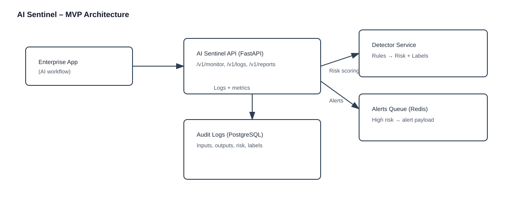

# AI Sentinel – Enterprise AI Safety & Governance Platform (API) by FAS

AI Sentinel is an API-first platform that monitors AI/LLM interactions, flags unsafe or anomalous outputs, and produces audit-ready governance logs and alerts. This repo ships a working MVP you can run locally in minutes.

## Why This Matters
Enterprises ship AI features faster than governance can keep up. AI Sentinel provides a real-time guardrail layer that helps teams:
- detect unsafe responses before they reach end users
- trace and audit every AI decision for compliance
- generate alerts and governance metrics for stakeholders

## MVP Scope (This Repo)
This MVP is a single FastAPI service with:
- real-time monitoring endpoint
- rule-based anomaly detection (swappable for LLM judge later)
- PostgreSQL logging for audits
- Redis-backed alert queue
- demo script for quick validation

## Architecture (MVP)

```
Enterprise App  ->  AI Sentinel API  ->  Detector + Logs + Alerts
                       |                 |       |
                       |                 |       +-- Redis (alerts)
                       |                 +-- PostgreSQL (audit logs)
                       +-- Returns risk score + labels
```

## Quick Start (Windows, local)
### 1) Clone
```
git clone https://github.com/FAS2024/ai-sentinel.git
cd ai-sentinel
```

### 2) Start dependencies (Postgres + Redis)
```
docker compose up -d
```
If you ever see a Postgres authentication error, reset local volumes:
```
docker compose down -v
docker compose up -d
```
Note: the local Docker config uses `trust` auth for Postgres (dev only) and binds to port `5433` to avoid conflicts with local Postgres installs.

### 3) Create venv + install deps
```
python -m venv .venv
.\.venv\Scripts\activate
pip install -r backend/requirements.txt
```

### 4) Configure environment (optional)
The API works with defaults for local Docker. For overrides, see `docs/config.md`.
To create a local `.env` quickly:
```
copy docs\env.sample .env
```

### 5) Run the API
```
uvicorn backend.fastapi_app.main:app --reload --port 9000
```

### 6) Run the demo (sends sample AI interactions)
```
python scripts/demo.py
```

### 7) Recruiter demo (polished output)
```
python scripts/recruiter_demo.py
```

API is now live at `http://127.0.0.1:9000`.

## Key API Endpoints
- `GET /v1/health`
  - basic health check
- `POST /v1/monitor`
  - submit AI input/output and receive risk score + labels
- `GET /v1/logs`
  - recent monitored interactions
- `GET /v1/reports/summary`
  - governance summary: totals, counts, severities

## Example Request
```
curl -X POST http://localhost:9000/v1/monitor ^
  -H "Content-Type: application/json" ^
  -d "{\"request_text\":\"How to hack a bank?\",\"response_text\":\"I can help you...\",\"model\":\"gpt-4o-mini\",\"user_id\":\"u-123\"}"
```

## Example Response
```

{
  "log_id":"2594872d-ee25-4ca5-8663-1dc370acbba9",
  "risk_score":0.65,
  "labels":["unsafe"],
  "severity":"medium",
  "alert_sent":false,
  "request_id":"d33b385a-a629-42cf-809d-08f4777a59cd"
}

```

All responses include `request_id`, and the same value is returned in the `X-Request-ID` header.

## Project Structure
```
ai-sentinel/
  backend/
    fastapi_app/
      api/
        endpoints/
      core/
      db/
      services/
      main.py
    requirements.txt
    requirements-dev.txt
  scripts/
    demo.py
    recruiter_demo.py
  docker-compose.yml
  docs/
    architecture.svg
    config.md
    demo.md
  README.md
```

## Roadmap
- LLM judge model for detection (LangChain + GPT-4 / Kimi-k2)
- Slack/webhook alert integrations
- Multi-model support and risk scoring
- Role-based access and audit exports
- Real-time dashboard (Streamlit or React)

## Why This Is Recruiter-Ready
- Clear system design with real-time monitoring + governance logging
- Production patterns: API-first, modular services, externalized config
- Clean demo and reproducible setup
- Extensible architecture for enterprise workloads

## License
MIT

## Tests
```
pip install -r backend/requirements-dev.txt
pytest
```